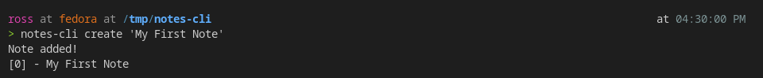
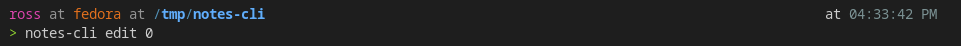
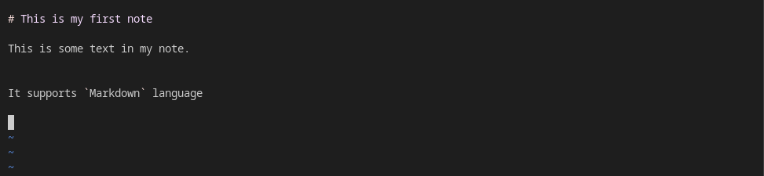
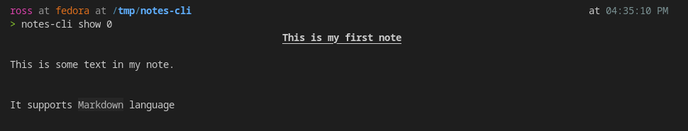

# Notes CLI Tool

This is a throw away project to learn/practice Rust.

## Usage

### Create a note

### Edit the note

### Edit the note in the editor of your choice. (use the `EDITOR` env variable)

### Display the note

